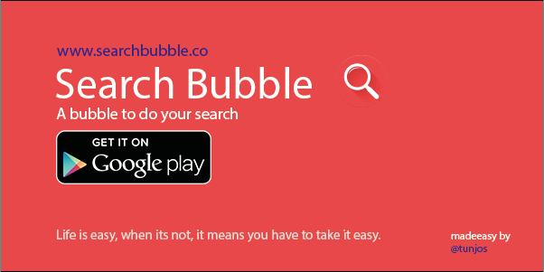

#Search Bubble

A bubble to do your search



Search Bubble allows you to Search with a Bubble. It's thats simple.  
In addition, it can auto store your clipboard history for one click searching from anywhere at anytime.

* For more information please visit [**searchubble.co**](http://www.searchbubble.co)
* powered by [**tunjos**](http://www.tunjos.com)


### Playstore Download
[**Search Bubble Playstore**](https://play.google.com/store/apps/details?id=com.tunjos.searchbubble)  
[](https://play.google.com/store/apps/details?id=com.tunjos.searchbubble)

### Direct APK Download
[**Search Bubble Apk**: (v1.0.0)](apk/SearchBubble-1.0.0.apk)

## Libraries used

- [**Realm**](https://realm.io/): **a mobile database, fast and easy to use.**  
Looking for all Clips that contain "Search Bubble" in its "description" field is as simple as  
```RealmResults<Clip> clips = realm.where(Clip.class).contains("description", "Search Bubble", true).findAll()```

- [**Dagger 2**](http://google.github.io/dagger/): **A fast dependency injector for Android and Java**  
Instead of creating a new Clip object yourself with ```Clip clip = new Clip();```  Dagger 2 makes it automatically from  
**Google Android HQ** and sends it to you, provided you do this ```@Inject Clip clip;```

- [**Butter Knife**](http://jakewharton.github.io/butterknife/): **Field and method binding for Android views**  
 Instead of writing ```TextView tvSearchBubble = (TextView)findViewById(R.id.tvSearchBubble);```,  
 you simply write ```@Bind(R.id.tvSearchBubble) TextView tvSearchBubble;``` and [**Jake Wharton**](http://github.com/jakewharton) will write the rest for you.

- [**AppIntro**](https://github.com/PaoloRotolo/AppIntro): **Android Library to make a cool intro for your app.**  
A great way to show a tutorial on how to use your app when and after it is first launched

- [**ChangeLog Library**](https://github.com/gabrielemariotti/changeloglib): **Android Library to display your changelog**  
Your changelog is a log or record of all the changes you made to your project

- [**Crashlytic**](https://get.fabric.io/crashlytics): **A powerful and lightweight crash reporting solution.**  
    Provides an online Dashboard to view crashes in your app.

- [**Rebound**](https://facebook.github.io/rebound/): **Spring Animations for Android.**  
    Allows you to create animations that feel natural by introducing real world physics to your application.

- [**LeakCanary**](https://github.com/square/leakcanary): **A memory leak detection library for Android and Java.**  
    Prevents your Android phone from sinking, due to memory leaks.


###[Support Libraries](http://developer.android.com/tools/support-library/index.html)
> The Android Support Library package is a set of code libraries that provide backward-compatible versions of Android framework APIs as well as features that are only available through the library APIs. Each Support Library is backward-compatible to a specific Android API level.

- [**v7 appcompat library**](https://developer.android.com/tools/support-library/features.html#v7-appcompat): **adds support for the Action Bar user interface design pattern.**

- [**v4 Support Library**](https://developer.android.com/tools/support-library/features.html#v4): **includes many things according to google.**

- [**v7 recyclerview library**](https://developer.android.com/tools/support-library/features.html#v7-recyclerview): **adds support for the RecyclerView widget, a view for efficiently displaying large data sets by providing a limited window of data items.**

- [**v7 cardview library**](https://developer.android.com/tools/support-library/features.html#v7-cardview): **adds support for the CardView widget, which lets you show information inside cards that have a consistent look on any app.**

- [**Design Support Library**](https://developer.android.com/tools/support-library/features.html#design):  **provides APIs to support adding material design components and patterns to your apps.**

License
-------

    Copyright 2015 Tunji Olu-Taiwo

    Licensed under the Apache License, Version 2.0 (the "License");
    you may not use this file except in compliance with the License.
    You may obtain a copy of the License at

       http://www.apache.org/licenses/LICENSE-2.0

    Unless required by applicable law or agreed to in writing, software
    distributed under the License is distributed on an "AS IS" BASIS,
    WITHOUT WARRANTIES OR CONDITIONS OF ANY KIND, either express or implied.
    See the License for the specific language governing permissions and
    limitations under the License.
